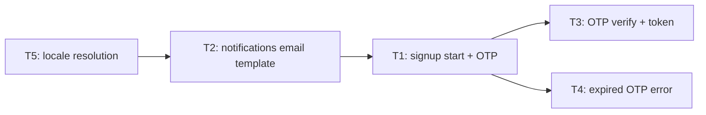

# sprint-manifest — Sprint Manifest + PRD promotion

This skill is **step 3** of the NONoise architectural workflow. It takes `validated` PRDs (output of `arch-decision`) and promotes them into a specific sprint, producing **one aggregated Sprint Manifest** per sprint that coordinates execution and defines the **macro functional tasks** developers will implement.

## Position in the workflow

```
┌─────────────┐   ┌──────────────┐   ┌──────────────────┐
│ arch-       │──▶│ arch-        │──▶│ sprint-manifest  │
│ brainstorm  │   │ decision     │   │ (THIS SKILL)     │
│             │   │              │   │                  │
│ produces    │   │ validates    │   │ promotes PRDs    │
│ PRDs as     │   │ via          │   │ to sprint +      │
│ draft       │   │ quint-fpf    │   │ aggregated       │
│             │   │              │   │ manifest         │
└─────────────┘   └──────────────┘   └──────────────────┘
     STEP 1            STEP 2              STEP 3
```

## What this skill does

1. **Promotes `validated` PRDs** by moving them from `docs/prd/<area>/` to `docs/sprints/Sprint-N/<area>/`.
2. **Generates (or updates) one aggregated Sprint Manifest** at `docs/sprints/Sprint-N/sprint-manifest.md` — a single sprint-level document listing all PRDs, deriving user stories, breaking work into macro tasks, mapping dependencies.
3. **Runs impact analysis** when a new PRD is added to an already-open sprint with an existing manifest.
4. **Assigns confidence CL1 / CL2 / CL3** to tasks and flags CL1 tasks that require a dedicated decision record before implementation.
5. **Provides the seed** for downstream work-item export skills (e.g. `spec-to-workitem`, `devops-push` if installed).

## What this skill does NOT do

- **Does not create PRDs** — that is `arch-brainstorm`'s job. If the user wants a new PRD, redirect.
- **Does not validate PRDs** — if a PRD is not `validated`, stop and redirect to `arch-decision`.
- **Does not write to `docs/architecture/`** — the architect updates the source of truth manually (driven by `arch-decision` Phase 6 "Impact on docs/architecture/" checklist), independently from this skill.
- **Does not generate per-feature micro-manifests** — one aggregated manifest per sprint, never split by area or by PRD.
- **Does not produce technical breakdowns** — tasks are **vertical functional slices**, not lists of files/classes/migrations to create.
- **Does not push to external issue trackers** — that is a separate skill invoked explicitly afterwards.

---

## Golden rule — MACRO granularity (read twice)

This is the most important rule of this skill. **Tasks and user stories must be VERTICAL FUNCTIONAL SLICES, not horizontal technical layers.**

A developer must be able to take a task, implement it end-to-end, test it in a visibly-functional way, and deliver it as a unit of value. Decomposition into files, classes, migrations, unit tests is **implementation detail** and is the developer's responsibility — **it must not be in the manifest**.

### Concrete example — hypothetical study `user-signup/01-email-otp`

#### ❌ WRONG — technical-layer tasks

```
- Task 1: Create migration for table `SignupSessions`
- Task 2: Create `SignupSession` entity in auth-service
- Task 3: Create ORM mapping for the new entity
- Task 4: Create `IEmailProvider` interface
- Task 5: Create `SendgridEmailProvider` implementation
- Task 6: Create `IOtpPolicy` interface
- Task 7: Create `DefaultOtpPolicy` implementation
- Task 8: Create `StartSignupHandler` skeleton
- Task 9: Create `SignupController` with POST /signup/start
- Task 10: Create `VerifyOtpCommand` in auth-service
- Task 11: Create `VerifyOtpHandler` in auth-service
- Task 12: Create endpoint POST /signup/verify-otp
- Task 13: Create `SignupNotificationHandler` in notifications
- ... (continues for another 10 tasks)
```

**Why this is wrong:**
- No task delivers **visible functional value**. Task 1 alone does nothing testable.
- The dev can't deliver incrementally — must do everything before seeing a result.
- The breakdown assumes the full technical architecture (classes, files). The manifest is deciding it, not the dev.
- Separate-layer tasks (DB, handler, controller) → forces rigid ordering and blocks parallel work at the functional level.

#### ✅ RIGHT — functional-slice tasks

```
- Task 1: "Operator starts signup with email and receives an OTP"
  POST /signup/start accepts an email, creates a session, emits an OTP via email provider.
  Visible test: curl POST → 200 + email received in Mailhog with 6-digit OTP.
  Confidence: CL2 (email pattern already in use for password-reset)
  Effort: 3–5 days

- Task 2: "Operator verifies OTP and receives a session token"
  POST /signup/verify-otp validates the OTP, marks the session complete, returns a JWT.
  Visible test: end-to-end — start signup, read OTP, submit it, get token, token validates on protected endpoint.
  Confidence: CL2 (JWT issuance pattern already in production)
  Effort: 2–3 days

- Task 3: "Expired OTP blocks verification with clear error"
  Sessions older than 10 minutes reject verification with a 410 Gone and a human message.
  Visible test: wait 11 minutes, submit OTP, receive 410 with error code `OTP_EXPIRED`.
  Confidence: CL3 (straightforward TTL check)
  Effort: 1 day

- Task 4: "Operator receives email with branded template and correct locale"
  Email template derives from locale header, uses shared branding, OTP is bold 6 chars.
  Visible test: send signup with `Accept-Language: it` → email body is in Italian.
  Confidence: CL1 (new template system, no prior) → [DECISION RECORD NEEDED on template resolution]
  Effort: 2–4 days
```

**Why this is right:**
- Each task delivers **visible, testable functional value**.
- The dev can work on them in parallel (with clear inter-task deps where they exist).
- The dev decides how to structure classes, files, migrations autonomously. The task says "what it does", not "how".
- Confidence CL is on the functional task, not on a single file — more meaningful.
- The developer can demo at the end of each task.

### Practical rule

| Question | If NO → the task is too micro |
|---|---|
| Does the task deliver a visible feature or end-to-end-testable behavior? | Too micro |
| Could a developer demo the result of this task alone? | Too micro |
| Would the task survive a refactor of internal file/class structure? | Too micro (too tied to code shape) |
| Does the task name sound like "implement feature X" or "enable Y"? | OK, macro |

If the task name is "Create class X.ts" or "Add column Y to table Z", **it's wrong**. If it's "Let the operator do Q" or "Enable flow R", it's right.

### Typical task size

| Measure | Typical value |
|---|---|
| Effort | 2–5 days of dev (includes tests) |
| Files touched | Typically 5–15 files across 2–4 layers |
| Components involved | Typically 1–3 |
| Demo-ability | Yes — result shown in ~5 minutes |

If a task is estimated >8–10 days, it is probably too big and should be split into 2 separate functional tasks. If a task is estimated <1 day, it is probably a hidden technical refactor and should be absorbed into a neighboring macro task.

### User stories sit above tasks

User stories are even higher than tasks — they are **complete user experiences**. Example for area `user-signup`:

- **US1 — Self-serve signup**: "As a new visitor, entering my email I receive an OTP and, after verifying it, I have an authenticated session."
- **US2 — Clear error recovery**: "As a new visitor with an expired OTP, I see a clear error and can request a new one without losing my progress."

A user story is delivered by **multiple tasks** (typically 3–8 per US). Tasks are the internal units of work; the user story is the externally-visible outcome.

---

## Arguments

`$ARGUMENTS` can be:

- `sprint N` — sprint N, process all `validated` PRDs from all areas
- `sprint N area=<slug>` — sprint N, process only the specified area
- `sprint N area=<slug> prd=NN` — sprint N, promote only one specific PRD of the area
- `sprint N update` — sprint N, update the existing manifest with a new PRD (impact analysis)
- `sprint N regenerate` — rebuild the manifest from scratch reading all already-promoted PRDs

If arguments are missing, ask the user for sprint + source.

---

## Flow — 5 steps

### Step 0 — determine the mode

Inspect arguments and repo state:

| Mode | Trigger | What it does |
|------|---------|--------------|
| **A. First manifest** | `Sprint-N/sprint-manifest.md` does not exist, validated PRDs ready | Promote PRDs, create manifest from scratch |
| **B. Impact analysis** | `Sprint-N/sprint-manifest.md` exists, a new PRD arrives | Promote the new PRD, update the existing manifest with impact analysis |
| **C. Regenerate** | User wants to rebuild the manifest without changing PRDs | Re-read promoted PRDs and rebuild the manifest |

Always announce the detected mode to the user.

---

### Step 1 — check prerequisites

Before touching any file:

1. **Check PRD state**: every PRD to process must have `status: validated` in its frontmatter.
   - `draft` → redirect: "PRD X is still in draft. Run `arch-decision <path>` before promoting it."
   - `superseded` → skip with a log entry (not an error)
   - `rejected` → skip with a log entry
   - `promoted` → already in a sprint, skip
   - Unrecognized frontmatter → error, ask the user what to do

2. **Check target sprint**: if the user has not specified the sprint, **ask explicitly** via `AskUserQuestion`. The sprint is mandatory.

3. **Check area consistency**: the `area` slug in the PRD frontmatter must match the folder name under `docs/prd/`. If there is a mismatch, flag it.

4. **Check audit report**: for every `validated` PRD there should be a matching audit report at `docs/prd/<area>/audit/NN-<study>-fpf.md`. If missing, flag as warning but continue (non-blocking).

If any check fails and is not recoverable, **stop** and ask the user how to proceed.

---

### Step 2 — promote PRDs

For every `validated` PRD to process:

1. **Move the files** from draft to sprint area:

   ```
   docs/prd/<area>/NN-<study>.md
   → docs/sprints/Sprint-N/<area>/NN-<study>.md

   docs/prd/<area>/NN-<study>-diagrams.md
   → docs/sprints/Sprint-N/<area>/NN-<study>-diagrams.md

   docs/prd/<area>/audit/NN-<study>-fpf.md
   → docs/sprints/Sprint-N/<area>/audit/NN-<study>-fpf.md
   ```

2. **Copy `00-area-brief.md`** into the sprint area folder on first promotion of that area, annotated with "Promoted to Sprint N in YYYY-MM-DD".

3. **Update the frontmatter** of the moved PRDs:

   ```yaml
   status: promoted
   sprint: <N>
   promoted_at: YYYY-MM-DD
   ```

4. **Leave a short pointer** in `docs/prd/<area>/` if the area has no remaining drafts — add a note in `00-area-brief.md` (don't remove the brief): "Studies promoted to Sprint N. Reuse this slug for new studies on this area." If there are still `draft` or `validated` non-promoted studies in the area, keep them in place and update the brief index accordingly.

---

### Step 3 — generate or update the Sprint Manifest

The sprint manifest lives at `docs/sprints/Sprint-N/sprint-manifest.md`. **One file per sprint**, not per area or per PRD.

#### Mode A (first manifest)

Create the file from scratch using the template below.

#### Mode B (impact analysis)

1. Read the existing manifest.
2. Read the newly-promoted PRDs.
3. For each task in the existing manifest, classify the impact:

   | Class | Meaning | Action |
   |---|---|---|
   | **UNCHANGED** | No new PRD touches this functional area | Skip |
   | **UPDATE** | A new PRD modifies contracts/behavior that affect this task | Update the task in the manifest (inline `Edit`) |
   | **NEW** | Feature not covered by any existing task | Add a new task to the manifest |
   | **CONFLICT** | The new PRD contradicts an existing task | Flag, ask the user |

4. **Present the impact table to the user before touching any file**. Explicit approval required.

5. Apply changes via `Edit`, never overwrite the whole file.

6. Append a changelog entry to the manifest:

   ```markdown
   ## Changelog
   - YYYY-MM-DD — Updated with PRD <area>/<NN-study>: [tasks X, Y added; tasks Z updated]
   ```

#### Mode C (regenerate)

Rebuild the manifest from scratch by reading all promoted PRDs. Use with caution — overwrites the existing manifest. Ask for explicit confirmation.

---

### Step 4 — apply the macro-granularity principle

When generating tasks for the manifest, **rigorously apply the macro principle described above**:

1. **Start from user stories**: for every PRD, extract 1–3 user stories from the "Decision story" and "Code changes checklist" sections. User stories are complete user experiences.

2. **From user stories to tasks**: for every user story, identify 3–8 macro functional tasks. Every task is a testable vertical slice.

3. **Do not split by layer**: if you find yourself writing "Create aggregate X", "Create repository X", "Create handler X", **stop and aggregate**. They are all part of the same functional task ("Enable operation on X").

4. **Every task has**:
   - **Functional name** (not "Create class X")
   - **Description** (what it does when done — visible behavior)
   - **Visible acceptance test** (how to verify, typically integration / end-to-end)
   - **Confidence CL1 / CL2 / CL3** (how well-known the pattern is)
   - **Effort** (days, typically 2–5)
   - **Dependencies** (other tasks that must be done first)
   - **Area** (reference to the source PRD)

5. **If total effort of an area exceeds the sprint**, flag it to the user. Do not arbitrarily shrink.

6. **Reject micro patterns**: if a user who read the manifest says "I need more detail", answer that detail is the developer's responsibility during implementation and belongs in code, not in the manifest.

---

### Step 5 — output and next steps

1. **Summary to the user**:
   - Target sprint: N
   - Promoted PRDs: list (area / NN-study)
   - Manifest: path
   - User stories: N
   - Macro tasks: N (total effort X days)
   - Tasks with confidence CL1 (decision record needed): N
   - Conflicts detected (mode B): N resolved / N open

2. **CL1 flag → decision record needed**:

   ```
   The following tasks have confidence CL1 and require an explicit decision record
   before implementation:

   - Task X: "<name>" → reason: <new pattern, no prior>
   - Task Y: "<name>" → reason: <new tech never used in the project>

   Want me to open an arch-brainstorm study for one of these?
   ```

3. **Suggested next step**:

   ```
   ✅ Sprint <N> ready with manifest.

   Next recommended steps:
   - Human review of the manifest: <path>
   - For CL1 tasks: run `arch-brainstorm` on the topic to close the knowledge gap
   - For external work-item export: if a skill like `spec-to-workitem` or `devops-push` is
     installed, invoke it on the manifest; otherwise copy tasks manually to your tracker
   - To add more PRDs to this sprint: `arch-brainstorm` + `arch-decision` + `sprint-manifest sprint <N> update`
   ```

4. **Never push automatically** to external trackers. That is an action with external side effects — it must be explicit and invoked separately.

---

## Sprint Manifest template

Mandatory structure for `docs/sprints/Sprint-N/sprint-manifest.md`:

```markdown
---
title: "Sprint <N> — Manifest"
sprint: <N>
kind: sprint-manifest
status: draft | approved | completed
created_at: YYYY-MM-DD
updated_at: YYYY-MM-DD
areas_covered: [<area-1>, <area-2>]
prd_refs:
  - area: <area-1>
    studies: [01-<study>, 02-<study>]
  - area: <area-2>
    studies: [01-<study>]
total_effort_days: <number>
---

# Sprint <N> — Manifest

> Sprint-level aggregator of the validated PRDs promoted to this sprint.
> Contains the breakdown in user stories and macro functional tasks for implementation.

## 1. Sprint goal

<1–2 sentences summarizing the sprint objective, derived from the goals of the promoted
PRDs. Example: "Enable self-serve signup with email + OTP verification, with clear error
recovery paths and audit trail of all attempts.">

## 2. PRDs included in this sprint

| Area | Study | Path | Goal | Aggregate confidence |
|---|---|---|---|---|
| user-signup | 01-email-otp | [path](./user-signup/01-email-otp.md) | OTP-based signup flow | CL2 |
| ... | ... | ... | ... | ... |

## 3. User stories

### US1 — <user-experience name>

**As** <role>, **I want** <what>, **so that** <why>.

**Covered by PRD**: <area>/<study>
**Acceptance test**: <how to verify end-to-end>
**Confidence**: CL2

### US2 — ...

## 4. Macro functional tasks

### Task T1 — <functional name>

- **Area**: <area-slug>
- **User story**: US1
- **Description**: <visible behavior when the task is done. 2–3 sentences, not a file list.>
- **Acceptance test**: <how to verify. Typically integration / end-to-end.>
- **Confidence**: CL1 | CL2 | CL3
- **Estimated effort**: <X> days
- **Dependencies**: [T2, T5] (or "none")
- **Components touched**: [auth-service, notifications]
- **Relevant PRD sections**: §2.2 "Flow", §5 "Target architecture"

### Task T2 — ...

## 5. Dependencies and execution order



<brief prose explanation of the suggested order>

## 6. Tasks with CL1 confidence (decision record needed)

Every CL1 task requires a dedicated decision record **before** implementation:

| Task | CL1 reason | Proposed DR / new arch-brainstorm study |
|---|---|---|
| T5 | Locale resolution policy new, no prior pattern | DR-NNN: "Locale resolution for templated emails" |

## 7. Risks and mitigations

| Risk | Severity | Mitigation |
|---|---|---|
| <risk> | 🔴/🟠/🟡 | <how to mitigate> |

## 8. Out of scope for this sprint

Explicit list of things NOT being done this sprint (even if they appear in PRDs):

- <item> — reason for deferral

## 9. Next steps after manifest

- [ ] Human review of the manifest by the architect
- [ ] Decision records for CL1 tasks: see section 6
- [ ] Export to external tracker: via `spec-to-workitem` / `devops-push` if installed
- [ ] External push (explicit, not automatic)

## Changelog

- YYYY-MM-DD — Manifest created by sprint-manifest (first run)
- YYYY-MM-DD — Updated with PRD <area>/<study> (impact analysis)
```

---

## Operating principles

1. **One manifest per sprint** — never separate files by area or by PRD. The manifest is the only sprint-level artifact.
2. **PRDs are immutable after promotion** — once promoted, the PRD in the sprint folder is frozen. If an important change is needed, create a new study (`02-<study>`) in `docs/prd/<area>/` and promote it with impact analysis.
3. **Macro granularity is mandatory** — reject any attempt at technical-layer tasks. If the user asks for more detail, explain that it is the developer's responsibility.
4. **CL1 → explicit decision record** — every CL1 task generates an entry in section 6 of the manifest. Do not swallow the risk.
5. **Impact analysis with approval** — never touch an existing manifest without presenting the impact table and getting approval.
6. **No automatic external push** — the manifest is a planning document. Export to a tracker is a separate, explicit action.

---

## Anti-patterns

1. **Technical-layer tasks** — "Create class X", "Create migration Y", "Add field Z". Always wrong. See the macro-granularity principle.
2. **Manifest too granular** — 50+ tasks per sprint is a signal that you are over-splitting. Aim at 10–20 macro tasks.
3. **Manifest too vague** — tasks without a visible acceptance test are not implementable.
4. **Over-generous confidence** — do not rate everything CL3. Be honest: if you have not seen the pattern in the codebase, it is CL2 at most. If the technology is new, it is CL1 and needs a decision record.
5. **Ignoring conflicts** — if a new PRD conflicts with an existing task, you MUST stop and ask the user. Never resolve silently.
6. **Unchanged PRD after impact analysis** — if a new PRD causes UPDATE on another PRD's tasks, that is a signal the two PRDs should be reviewed together. Flag it.

## When NOT to use this skill

- No PRD is in `validated` state → use `arch-brainstorm` + `arch-decision` first
- The user wants to push work items directly → use a dedicated export skill
- The user wants to change a PRD already promoted → create a new study, do not edit the promoted one

---

## Reference files

- `docs/prd/<area>/*.md` — source of validated PRDs
- `docs/sprints/Sprint-N/` — promotion destination (one folder per sprint)
- `docs/sprints/Sprint-N/sprint-manifest.md` — the aggregated sprint manifest (one per sprint)
- `docs/sprints/Sprint-N/<area>/*.md` — promoted PRDs + audits
- `docs/architecture/` — source of truth (read-only for this skill)

## Related skills

- [`arch-brainstorm`](../arch-brainstorm/SKILL.md) — produces PRDs (step 1)
- [`arch-decision`](../arch-decision/SKILL.md) — validates PRDs via `quint-fpf` (step 2)
- Future `spec-to-workitem` / `devops-push` — translate the manifest into external work items (next step after this skill, optional)
